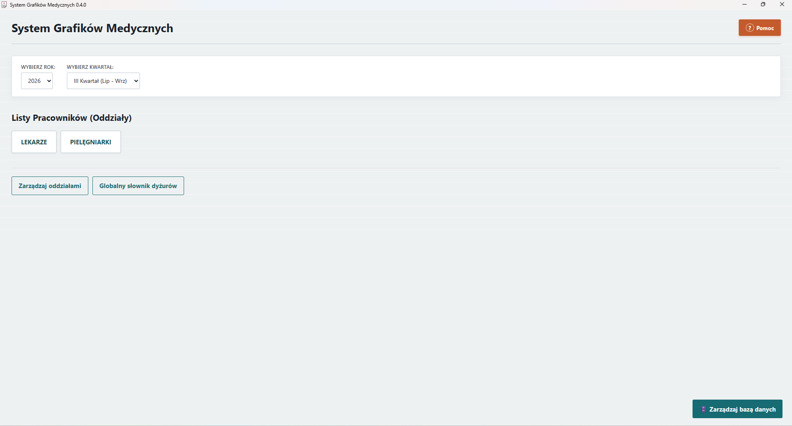
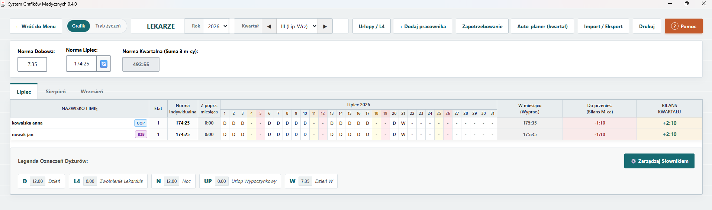

# System Grafików Medycznych 🏥

Zaawansowana aplikacja desktopowa do zarządzania harmonogramami pracowników placówek medycznych (szpitale, kliniki, poradnie). System pozwala na planowanie, organizację i monitorowanie grafików pracowników medycznych z obsługą różnych typów zmian, oddziałów, norm miesięcznych i rozliczeń kwartalnych.

## 📋 Spis treści

- [O projekcie](#o-projekcie)
- [Przeznaczenie](#przeznaczenie)
- [Główne funkcje](#główne-funkcje)
- [Wymagania systemowe](#wymagania-systemowe)
- [Instalacja](#instalacja)
- [Jak korzystać](#jak-korzystać)
- [Zrzuty ekranu](#zrzuty-ekranu)
- [Architektura](#architektura)
- [Gdzie wykorzystać](#gdzie-wykorzystać)
- [Autor](#autor)
- [Raportowanie błędów](#raportowanie-błędów)
- [Licencja](#licencja)

## O projekcie

**System Grafików Medycznych** to profesjonalna aplikacja desktopowa oparta na technologii Tauri, React i TypeScript. Aplikacja umożliwia efektywne zarządzanie harmonogramami pracy personelu medycznego z wysoce zautomatyzowanymi funkcjami planowania i rozliczania czasu pracy.

### Identyfikator
- **Nazwa wewnętrzna**: `com.skaskiewicz.grafik-medyczny`
- **Wersja**: 0.3.1
- **Status**: Stabilna wersja produkcyjna

## Przeznaczenie

Aplikacja została stworzona dla placówek medycznych, które potrzebują narzędzia do:
- Profesjonalnego zarządzania harmonogramami pracy personelu
- Automatycznego wyliczania i monitorowania norm czasu pracy w ujęciu miesięcznym i kwartalnym
- Organizacji zmian w systemie wielooddziałowym
- Śledzenia urlopów, zwolnień lekarskich i innych absencji
- Raportowania, drukowania grafików i analizy obciążenia pracowników

## Główne funkcje

### 👥 Zarządzanie personelem
- Rejestracja i katalog pracowników z przypisaniem do konkretnych oddziałów.
- Obsługa etatów (system automatycznie wylicza indywidualną normę godzinową, np. dla 0.5 etatu).
- Bezpieczna archiwizacja - pracownicy kończący współpracę znikają z nowych grafików, ale ich historia w poprzednich miesiącach pozostaje nienaruszona.
- Automatyczne tworzenie profili pracowników w bazie podczas importu danych z plików CSV.

### 📅 Harmonogramowanie i Rozliczenia
- Tworzenie grafików z przejrzystym podziałem na miesiące i kwartały.
- Pełen automatyzm: System sam oblicza dni robocze, uwzględnia weekendy oraz automatycznie identyfikuje polskie święta państwowe i kościelne (w tym ruchomą Wielkanoc).
- Automatyczne przenoszenie bilansu godzin (nadgodziny/niedogodziny) na kolejne miesiące w ramach jednego kwartału.
- Auto-zapis: Wszystkie zmiany wprowadzane w grafiku (kody dyżurów, zmiany etatu, normy) zapisują się natychmiast w tle – brak ryzyka utraty danych.

### 🔄 Słowniki i Typy zmian
Aplikacja bazuje na kodach literowych, które można dowolnie edytować globalnie lub wyłącznie dla konkretnego oddziału w danym miesiącu. Domyślne kody:
- **D** - Dzień (720 minut)
- **N** - Noc (720 minut)
- **W** - Dzień W (455 minut)
- **L4** - Zwolnienie Lekarskie (0 minut)
- **UP** - Urlop Wypoczynkowy (0 minut)

### 💾 Baza danych i Integracje
- Wbudowana lekka baza SQLite działająca w 100% offline, co gwarantuje pełną prywatność i bezpieczeństwo danych personelu.
- Eksport i Import CSV: Błyskawiczne generowanie rocznych szablonów i możliwość importu wypełnionych grafików prosto z programu Excel.
- Łatwe zarządzanie plikiem bazy: możliwość przeniesienia bazy na dysk sieciowy (NAS) lub chmurę (np. OneDrive/Dropbox) w celu współdzielenia danych na wielu stanowiskach.
- Wbudowany system tworzenia bezpiecznych kopii zapasowych (Backup).

## Wymagania systemowe

- **System operacyjny**: Windows 10 / 11 (64-bit)
- **Dodatkowe**: Aplikacja działa całkowicie offline, nie wymaga połączenia z internetem.

## Instalacja

### Pobieranie
1. Pobierz najnowszą wersję instalatora (`.exe`) z sekcji Release.
2. Uruchom plik i zainstaluj aplikację w wybranym folderze.

### Uruchomienie i Konfiguracja
1. Kliknij dwukrotnie skrót na pulpicie.
2. Aplikacja przy pierwszym uruchomieniu automatycznie utworzy strukturę bazy danych (domyślnie w bezpiecznym folderze `%APPDATA%`).
3. Z poziomu menu głównego (przycisk "Przenieś bazę") możesz w każdej chwili przenieść plik bazy danych do innej lokalizacji roboczej.

## Jak korzystać

### Pierwsze kroki
1. **Utwórz oddziały** - Zdefiniuj strukturę organizacyjną za pomocą przycisku "Zarządzaj Oddziałami".
2. **Dodaj pracowników** - Wejdź w wybrany oddział, kliknij "+ Dodaj pracownika", podaj imię, nazwisko i określ wymiar etatu.
3. **Dostosuj normę** - Określ normę dobową dla oddziału (system sam przeliczy z tego normę miesięczną na podstawie dni roboczych).
4. **Wypełnij grafik** - Używaj klawiatury (Tab/Enter), aby błyskawicznie wpisywać kody dyżurów w podświetlone pola.

### Importowanie / Eksportowanie grafików
- Użyj przycisku **"Import / Eksport"** w prawym górnym rogu grafiku.
- Wyeksportuj pusty szablon CSV dla wybranego roku.
- Wypełnij plik w programie Excel (wklejając dane ze starych systemów) i zaimportuj go z powrotem jednym kliknięciem.

### Drukowanie
- Gdy grafik jest gotowy, kliknij przycisk **"🖨️ Drukuj"**.
- Wybierz, czy chcesz wydrukować tylko wybrany miesiąc, czy kompleksowe rozliczenie całego kwartału.
- Aplikacja automatycznie ukryje interfejs i wygeneruje czysty, sformatowany dokument gotowy do podpisu.

## Zrzuty ekranu






## Architektura

### Technologie
```text
Frontend:
├── React 19.1.0 - Framework UI
├── TypeScript 5.8.3
├── Vite 7.0.4 - Build tool
└── CSS - Własna, zoptymalizowana stylizacja pod kątem wydruku

Backend:
├── Rust - Logika, bezpieczeństwo i wydajność
├── Tauri 2.x - Framework desktopowy
└── SQLite - Lokalna baza danych

Wtyczki Tauri:
├── @tauri-apps/plugin-fs - Operacje na systemie plików (kopie zapasowe, przenoszenie bazy)
├── @tauri-apps/plugin-dialog - Natywne okna dialogowe Windows
├── @tauri-apps/plugin-sql - Bezpośredni dostęp do bazy danych
└── @tauri-apps/plugin-opener - Otwieranie folderów roboczych
```

## Gdzie wykorzystać

### Idealne dla:
- ✅ **Szpitali i klinik** - Zarządzanie skomplikowanymi zmianami personelu medycznego.
- ✅ **Przychodni i poradni** - Szybkie planowanie grafików lekarzy i pielęgniarek.
- ✅ **Domów opieki** - Harmonogramowanie pracy opiekunów medycznych.
- ✅ **Placówek diagnostycznych** - Kontrola dostępności techników i diagnostów.

## Obsługiwane operacje

- ✅ Dodawanie, edycja i bezpieczna archiwizacja pracowników.
- ✅ Zarządzanie oddziałami (departamentami) i ich normami.
- ✅ Pełna edycja globalnych i lokalnych (miesięcznych) słowników dyżurów.
- ✅ Inteligentne, automatyczne wyliczanie polskich świąt i weekendów.
- ✅ Automatyczne zliczanie wypracowanych minut, bilansu miesięcznego i kwartalnego.
- ✅ Import oraz Eksport rocznych grafików do plików CSV (wsparcie dla MS Excel).
- ✅ Drukowanie zoptymalizowanych zestawień miesięcznych i kwartalnych.
- ✅ Przenoszenie pliku bazy danych (wsparcie dla dysków sieciowych / chmury publicznej).
- ✅ Automatyczny zapis (auto-save) w tle zapobiegający utracie danych.

## Autor

**Projekt stworzony przez**: Kamil Skaskiewicz  
**Kontakt**: sgm.kontakt@mailplus.pl  
**Identyfikator pakietu**: com.skaskiewicz.grafik-medyczny

## ❤️ Wsparcie projektu (Drobna prośba)

Aplikacja jest rozwijana z pasji i udostępniana **całkowicie za darmo** – bez żadnych ukrytych opłat, subskrypcji czy ograniczeń czasowych.

Nie oczekuję wsparcia finansowego, jednak najlepszą i najbardziej motywującą "zapłatą" za setki godzin włożonych w napisanie tego programu jest dla mnie informacja, że faktycznie pomaga on w Waszej codziennej pracy!

Jeśli z powodzeniem korzystacie z **Systemu Grafików Medycznych** w swoim szpitalu, klinice, poradni czy oddziale, będzie mi niezmiernie miło, jeśli wyrazicie zgodę na umieszczenie nazwy Waszej placówki na oficjalnej liście użytkowników (w przygotowywanej sekcji *"Zaufali nam"*). 

Jeśli chcielibyście w ten symboliczny sposób podziękować za program, bardzo proszę o krótką wiadomość z nazwą placówki (poprzez GitHub Issues lub email: sgm.kontakt@mailplus.pl). Zobaczenie, gdzie mój kod ułatwia życie personelowi medycznemu, to dla mnie największa satysfakcja!

## Raportowanie błędów

Jeśli napotkasz błąd, problem lub chcesz zaproponować nową funkcjonalność, zachęcam do kontaktu poprzez zakładkę **Issues** w repozytorium projektu na GitHubie lub bezpośredni kontakt mailowy: sgm.kontakt@mailplus.pl.

### Informacje, które warto załączyć przy zgłoszeniu:
- **Wersja aplikacji**: 0.3.1
- **System operacyjny**: np. Windows 11
- **Opis problemu**: Szczegółowy opis tego, co się stało.
- **Kroki do reprodukcji**: Krok po kroku, jak powtórzyć błąd.

## Licencja

**System Grafików Medycznych** jest udostępniany jako **bezpłatne oprogramowanie proprietarne (własnościowe)**.

### Warunki licencji:

✅ **Co jest dozwolone:**
- Bezpłatne pobieranie i instalacja.
- Użytkowanie w celach osobistych oraz komercyjnych.
- Wdrażanie i używanie w placówkach medycznych (szpitale, kliniki, przychodnie).
- Wielokrotne instalacje na wielu stanowiskach na potrzeby danej organizacji.
- Użytkowanie bez jakichkolwiek ograniczeń czasowych.

❌ **Co jest zabronione:**
- Próby dostępu do kodu źródłowego, dekompilacja, inżynieria wsteczna.
- Modyfikacja, zmiana aplikacji lub tworzenie wersji pochodnych.
- Rozpowszechnianie odpłatne (odsprzedaż, wynajem).
- Usuwanie informacji o autorze i prawach autorskich.

### Pliki licencji:
Pełne warunki licencji znajdują się w plikach dołączonych do oprogramowania:
- `LICENSE.pl` - Licencja w języku polskim
- `LICENSE` - Licencja w języku angielskim

Korzystając z aplikacji, akceptujesz wszystkie warunki licencji.

---

**Dziękuję za korzystanie z Systemu Grafików Medycznych!** 🏥✨